# [📈 Live Status](https://status.offerpath.co): <!--live status--> **🟩 All systems operational**

This repository contains the open-source uptime monitor and status page for [scaleupventures01](https://status.offerpath.co), powered by [Upptime](https://github.com/upptime/upptime).

With [Upptime](https://upptime.js.org), you can get your own unlimited and free uptime monitor and status page, powered entirely by a GitHub repository. We use [Issues](https://github.com/scaleupventures01/offerpath-upptime/issues) as incident reports, [Actions](https://github.com/scaleupventures01/offerpath-upptime/actions) as uptime monitors, and [Pages](https://status.offerpath.co) for the status page.

<!--start: status pages-->
<!-- This summary is generated by Upptime (https://github.com/upptime/upptime) -->
<!-- Do not edit this manually, your changes will be overwritten -->
<!-- prettier-ignore -->
| URL | Status | History | Response Time | Uptime |
| --- | ------ | ------- | ------------- | ------ |
|  [Homepage](https://www.offerpath.co) | 🟩 Up | [homepage.yml](https://github.com/scaleupventures01/offerpath-upptime/commits/HEAD/history/homepage.yml) | 

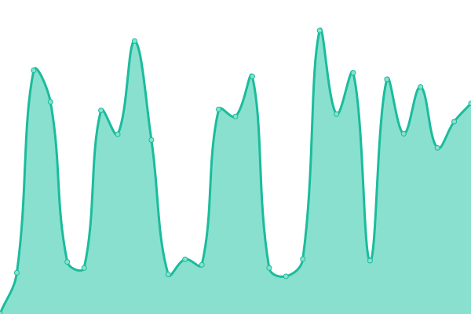 776ms
     
 | 

<a href="https://status.offerpath.co/history/homepage">100.00%</a>
    

|  [About](https://www.offerpath.co/about) | 🟩 Up | [about.yml](https://github.com/scaleupventures01/offerpath-upptime/commits/HEAD/history/about.yml) | 

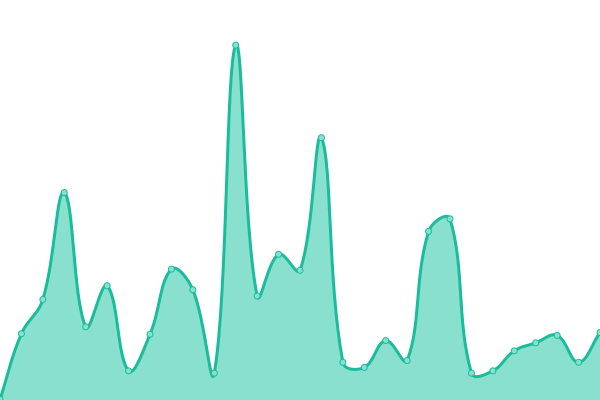 366ms
     
 | 

<a href="https://status.offerpath.co/history/about">100.00%</a>
    

|  [Calculator](https://www.offerpath.co/calculator) | 🟩 Up | [calculator.yml](https://github.com/scaleupventures01/offerpath-upptime/commits/HEAD/history/calculator.yml) | 

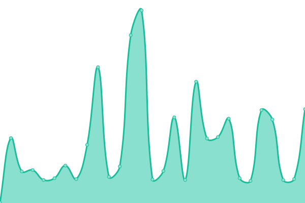 393ms
     
 | 

<a href="https://status.offerpath.co/history/calculator">100.00%</a>
    

|  [Cancellation](https://www.offerpath.co/cancellation) | 🟩 Up | [cancellation.yml](https://github.com/scaleupventures01/offerpath-upptime/commits/HEAD/history/cancellation.yml) | 

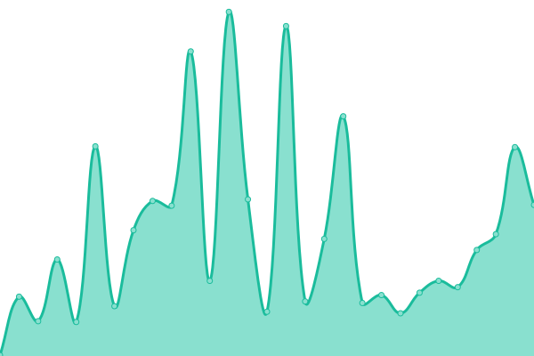 297ms
     
 | 

<a href="https://status.offerpath.co/history/cancellation">100.00%</a>
    

|  [Church Board](https://www.offerpath.co/church-board) | 🟩 Up | [church-board.yml](https://github.com/scaleupventures01/offerpath-upptime/commits/HEAD/history/church-board.yml) | 

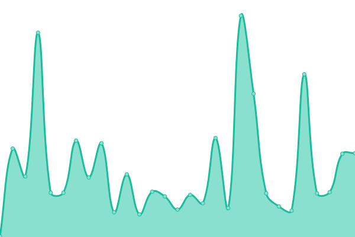 233ms
     
 | 

<a href="https://status.offerpath.co/history/church-board">100.00%</a>
    

|  [Enterprise](https://www.offerpath.co/enterprise) | 🟩 Up | [enterprise.yml](https://github.com/scaleupventures01/offerpath-upptime/commits/HEAD/history/enterprise.yml) | 

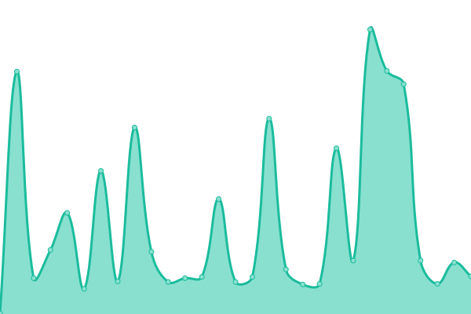 237ms
     
 | 

<a href="https://status.offerpath.co/history/enterprise">100.00%</a>
    

|  [FAQ](https://www.offerpath.co/faq) | 🟩 Up | [faq.yml](https://github.com/scaleupventures01/offerpath-upptime/commits/HEAD/history/faq.yml) | 

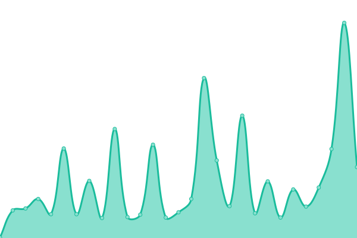 280ms
     
 | 

<a href="https://status.offerpath.co/history/faq">100.00%</a>
    

|  [For Designers](https://www.offerpath.co/for-designers) | 🟩 Up | [for-designers.yml](https://github.com/scaleupventures01/offerpath-upptime/commits/HEAD/history/for-designers.yml) | 

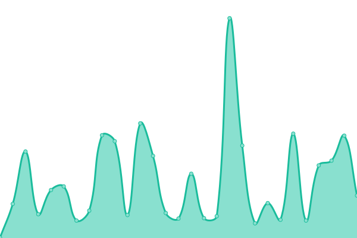 246ms
     
 | 

<a href="https://status.offerpath.co/history/for-designers">100.00%</a>
    

|  [For Engineers](https://www.offerpath.co/for-engineers) | 🟩 Up | [for-engineers.yml](https://github.com/scaleupventures01/offerpath-upptime/commits/HEAD/history/for-engineers.yml) | 

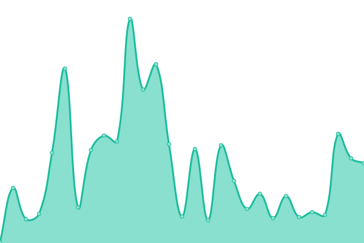 217ms
     
 | 

<a href="https://status.offerpath.co/history/for-engineers">100.00%</a>
    

|  [For Product Managers](https://www.offerpath.co/for-product-managers) | 🟩 Up | [for-product-managers.yml](https://github.com/scaleupventures01/offerpath-upptime/commits/HEAD/history/for-product-managers.yml) | 

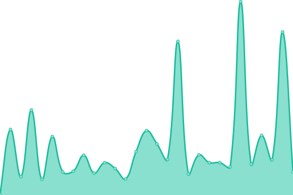 233ms
     
 | 

<a href="https://status.offerpath.co/history/for-product-managers">100.00%</a>
    

|  [For Visa Holders](https://www.offerpath.co/for-visa-holders) | 🟩 Up | [for-visa-holders.yml](https://github.com/scaleupventures01/offerpath-upptime/commits/HEAD/history/for-visa-holders.yml) | 

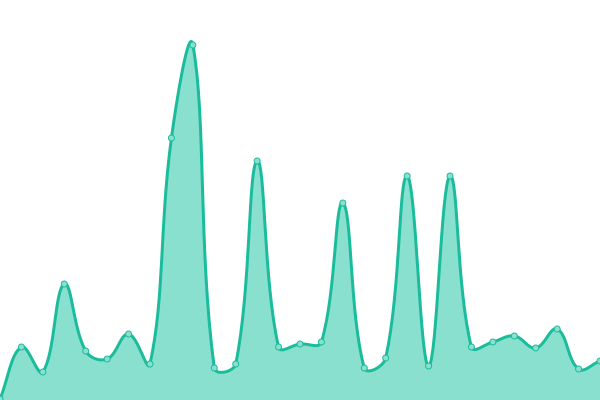 261ms
     
 | 

<a href="https://status.offerpath.co/history/for-visa-holders">100.00%</a>
    

|  [Glossary](https://www.offerpath.co/glossary) | 🟩 Up | [glossary.yml](https://github.com/scaleupventures01/offerpath-upptime/commits/HEAD/history/glossary.yml) | 

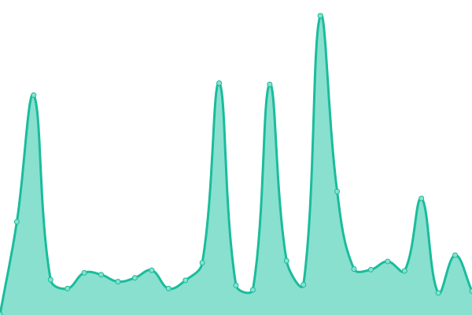 501ms
     
 | 

<a href="https://status.offerpath.co/history/glossary">100.00%</a>
    

|  [Insights](https://www.offerpath.co/insights) | 🟩 Up | [insights.yml](https://github.com/scaleupventures01/offerpath-upptime/commits/HEAD/history/insights.yml) | 

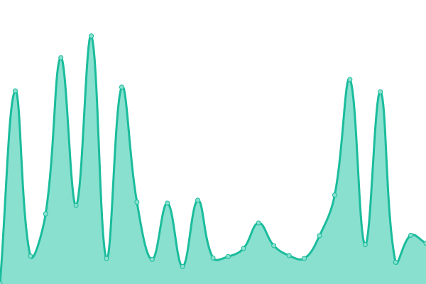 235ms
     
 | 

<a href="https://status.offerpath.co/history/insights">100.00%</a>
    

|  [Jobs](https://www.offerpath.co/jobs) | 🟩 Up | [jobs.yml](https://github.com/scaleupventures01/offerpath-upptime/commits/HEAD/history/jobs.yml) | 

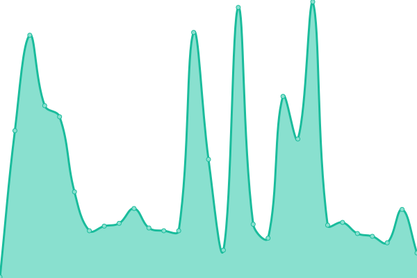 256ms
     
 | 

<a href="https://status.offerpath.co/history/jobs">100.00%</a>
    

|  [LinkedIn Optimization](https://www.offerpath.co/linkedin-optimization) | 🟩 Up | [linked-in-optimization.yml](https://github.com/scaleupventures01/offerpath-upptime/commits/HEAD/history/linked-in-optimization.yml) | 

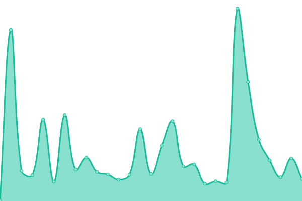 228ms
     
 | 

<a href="https://status.offerpath.co/history/linked-in-optimization">100.00%</a>
    

|  [Login](https://www.offerpath.co/login) | 🟩 Up | [login.yml](https://github.com/scaleupventures01/offerpath-upptime/commits/HEAD/history/login.yml) | 

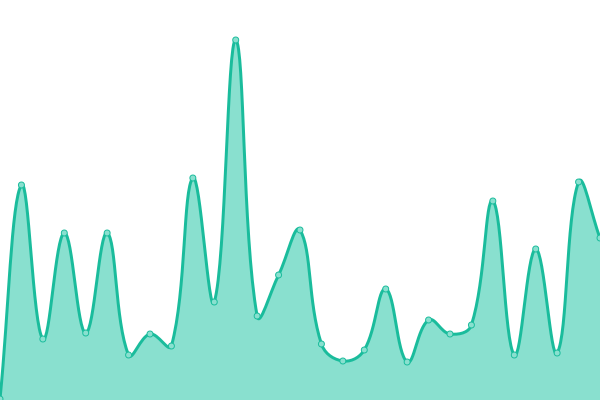 219ms
     
 | 

<a href="https://status.offerpath.co/history/login">100.00%</a>
    

|  [Partners](https://www.offerpath.co/partners) | 🟩 Up | [partners.yml](https://github.com/scaleupventures01/offerpath-upptime/commits/HEAD/history/partners.yml) | 

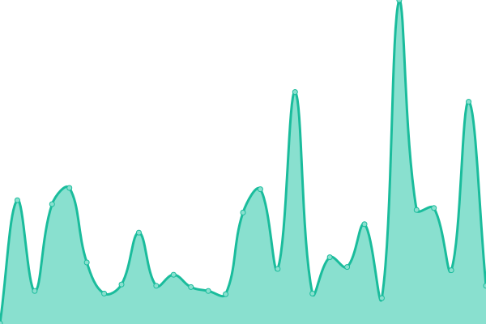 216ms
     
 | 

<a href="https://status.offerpath.co/history/partners">100.00%</a>
    

|  [Pricing](https://www.offerpath.co/pricing) | 🟩 Up | [pricing.yml](https://github.com/scaleupventures01/offerpath-upptime/commits/HEAD/history/pricing.yml) | 

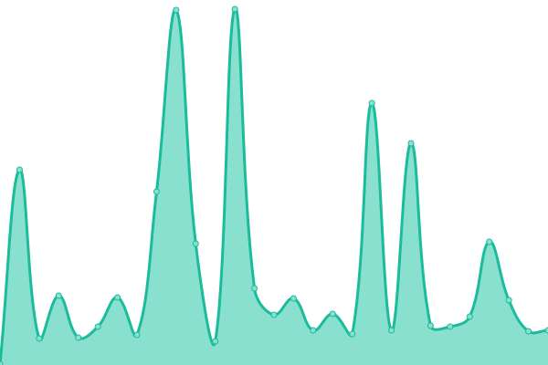 194ms
     
 | 

<a href="https://status.offerpath.co/history/pricing">100.00%</a>
    

|  [Privacy Policy](https://www.offerpath.co/privacy) | 🟩 Up | [privacy-policy.yml](https://github.com/scaleupventures01/offerpath-upptime/commits/HEAD/history/privacy-policy.yml) | 

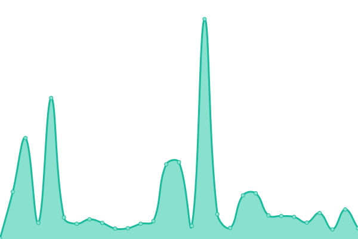 218ms
     
 | 

<a href="https://status.offerpath.co/history/privacy-policy">100.00%</a>
    

|  [Resources](https://www.offerpath.co/resources) | 🟩 Up | [resources.yml](https://github.com/scaleupventures01/offerpath-upptime/commits/HEAD/history/resources.yml) | 

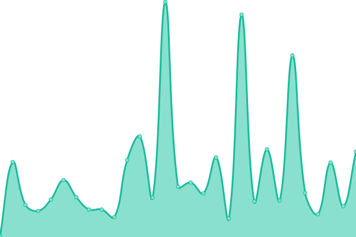 192ms
     
 | 

<a href="https://status.offerpath.co/history/resources">100.00%</a>
    

|  [Salary Discovery](https://www.offerpath.co/salary-discovery) | 🟩 Up | [salary-discovery.yml](https://github.com/scaleupventures01/offerpath-upptime/commits/HEAD/history/salary-discovery.yml) | 

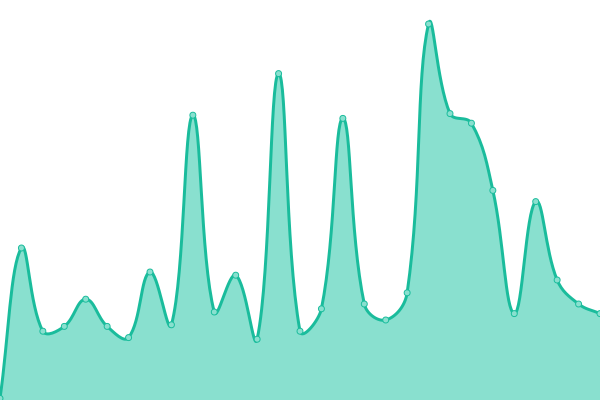 200ms
     
 | 

<a href="https://status.offerpath.co/history/salary-discovery">100.00%</a>
    

|  [ScaleJobs](https://www.offerpath.co/scalejobs) | 🟩 Up | [scale-jobs.yml](https://github.com/scaleupventures01/offerpath-upptime/commits/HEAD/history/scale-jobs.yml) | 

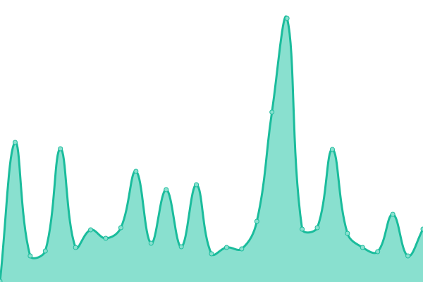 203ms
     
 | 

<a href="https://status.offerpath.co/history/scale-jobs">100.00%</a>
    

|  [Schedule](https://www.offerpath.co/schedule) | 🟩 Up | [schedule.yml](https://github.com/scaleupventures01/offerpath-upptime/commits/HEAD/history/schedule.yml) | 

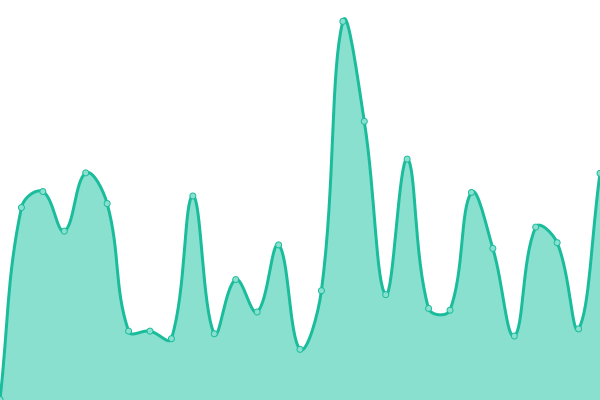 248ms
     
 | 

<a href="https://status.offerpath.co/history/schedule">100.00%</a>
    

|  [Sign Up](https://www.offerpath.co/signup) | 🟩 Up | [sign-up.yml](https://github.com/scaleupventures01/offerpath-upptime/commits/HEAD/history/sign-up.yml) | 

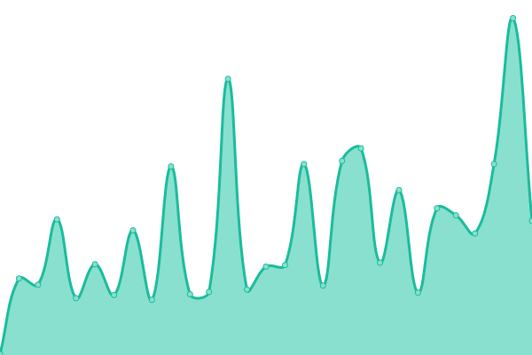 189ms
     
 | 

<a href="https://status.offerpath.co/history/sign-up">100.00%</a>
    

|  [Success Stories](https://www.offerpath.co/success-stories) | 🟩 Up | [success-stories.yml](https://github.com/scaleupventures01/offerpath-upptime/commits/HEAD/history/success-stories.yml) | 

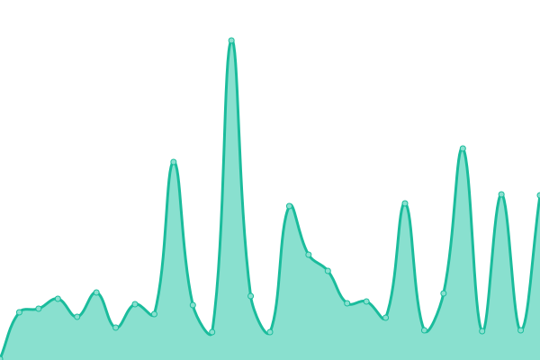 229ms
     
 | 

<a href="https://status.offerpath.co/history/success-stories">100.00%</a>
    

|  [Terms of Service](https://www.offerpath.co/terms) | 🟩 Up | [terms-of-service.yml](https://github.com/scaleupventures01/offerpath-upptime/commits/HEAD/history/terms-of-service.yml) | 

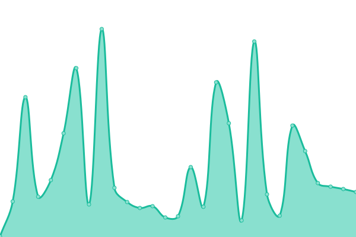 260ms
     
 | 

<a href="https://status.offerpath.co/history/terms-of-service">100.00%</a>
    

|  [Tool: ATS Checker](https://www.offerpath.co/tools/ats-checker) | 🟩 Up | [tool-ats-checker.yml](https://github.com/scaleupventures01/offerpath-upptime/commits/HEAD/history/tool-ats-checker.yml) | 

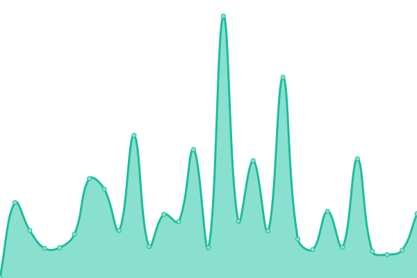 181ms
     
 | 

<a href="https://status.offerpath.co/history/tool-ats-checker">100.00%</a>
    

|  [Tool: Cover Letter](https://www.offerpath.co/tools/cover-letter) | 🟩 Up | [tool-cover-letter.yml](https://github.com/scaleupventures01/offerpath-upptime/commits/HEAD/history/tool-cover-letter.yml) | 

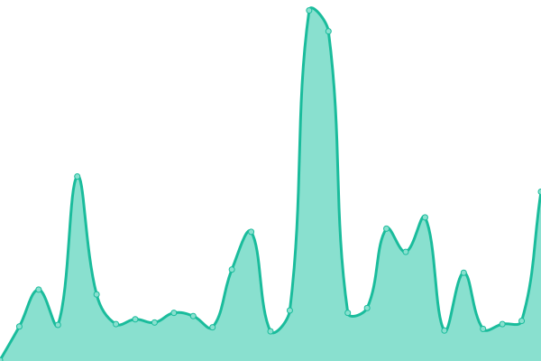 256ms
     
 | 

<a href="https://status.offerpath.co/history/tool-cover-letter">100.00%</a>
    

|  [Tool: LinkedIn Analyzer](https://www.offerpath.co/tools/linkedin-analyzer) | 🟩 Up | [tool-linked-in-analyzer.yml](https://github.com/scaleupventures01/offerpath-upptime/commits/HEAD/history/tool-linked-in-analyzer.yml) | 

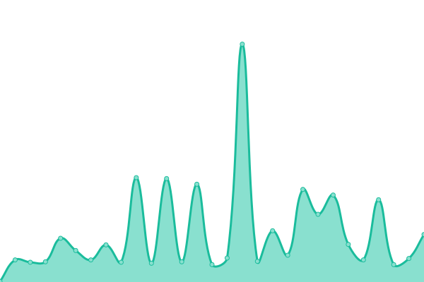 225ms
     
 | 

<a href="https://status.offerpath.co/history/tool-linked-in-analyzer">100.00%</a>
    

|  [Tool: Salary Calculator](https://www.offerpath.co/tools/salary) | 🟩 Up | [tool-salary-calculator.yml](https://github.com/scaleupventures01/offerpath-upptime/commits/HEAD/history/tool-salary-calculator.yml) | 

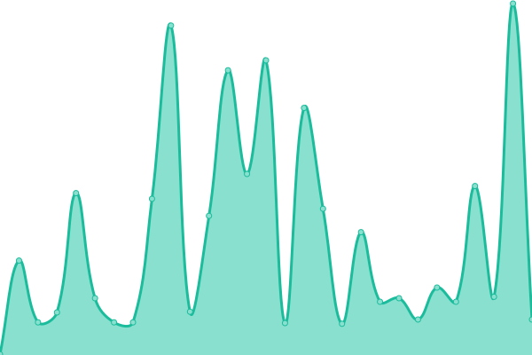 231ms
     
 | 

<a href="https://status.offerpath.co/history/tool-salary-calculator">100.00%</a>
    

<!--end: status pages-->

[**Visit our status website →**](https://status.offerpath.co)

## 📄 License

- Powered by: [Upptime](https://github.com/upptime/upptime)
- Code: [MIT](./LICENSE) © [Anand Chowdhary](https://anandchowdhary.com), supported by [Pabio](https://pabio.com)
- Data in the `./history` directory: [Open Database License](https://opendatacommons.org/licenses/odbl/1-0/)
